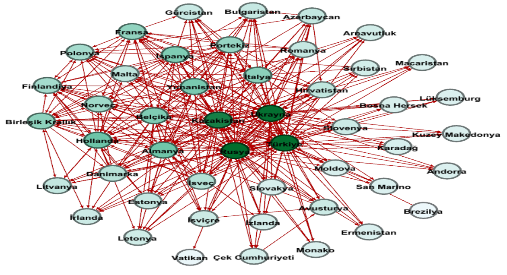

# 🌍 IMPORT RELATIONSHIPS OF EUROPEAN COUNTRIES — Social Network Analysis

---

## 📘 Project Overview

This project focuses on **analyzing the import relationships among European countries** using **Social Network Analysis (SNA)**.  
The main goal is to examine how countries interact with each other through imports, providing a deeper understanding of **trade networks in Europe**.  

The analysis includes:
- Calculating **centrality measures** for each country  
- **Visualizing** the trade network  
- Deriving **insights** from both individual and global perspectives  

By combining **web scraping**, **data preprocessing**, and **network analysis**, this project offers a data-driven perspective on how goods flow across Europe.

---

## 🧾 Data Description

The dataset consists of **import data between European countries**, collected using **Selenium**.  
It follows this structure:

| Column | Description |
|---------|-------------|
| **Source Country** | The country exporting goods |
| **Target Country** | The country importing goods |
| **Weight** | The volume or value of imports between the countries |

After scraping, the dataset was cleaned using **Pandas** to ensure accuracy and consistency before being transformed into a network-ready format.

---

## 🧰 Data Collection Process

### 🔹 Web Scraping with Selenium
Selenium was used to automate the extraction of trade data from web pages, including:
- Navigating through trade statistics portals  
- Identifying relevant data tables  
- Extracting **country-to-country import volumes**

### 🔹 Data Cleaning
The raw data was cleaned with **Pandas** and **NumPy**:
- Removed duplicates and missing entries  
- Standardized country names and formats  
- Structured for use in network analysis tools  

---

## 🌐 Network Construction and Visualization

After preprocessing, the data was converted into a **directed weighted network**:
- **Nodes** → European countries  
- **Edges** → Import connections  
- **Weights** → Trade value/volume  

### 🧩 Visualization in Gephi
The resulting network graph was imported into **Gephi** for visualization and exploration.  
This helped reveal trade clusters, influential nodes, and import dependencies across Europe.

---

## 📊 Analytical Focus

| Measure | Description |
|----------|-------------|
| **Indegree Centrality** | Number of countries that import from a specific country |
| **Outdegree Centrality** | Number of countries a specific country exports to |
| **Betweenness Centrality** | Influence of a country as an intermediary in trade |
| **Closeness Centrality** | How easily a country can reach other countries in the network |

These measures reveal:
- **Dominant import/export hubs**  
- **Bridging countries** that connect regional markets  
- **Trade flow structures** in the European economy  

---

## 🧮 Required Libraries

```python
pandas    # For data manipulation and cleaning
numpy     # For numerical operations
selenium  # For automated data collection
networkx  # For network creation and analysis
gephi     # For visualization (external tool)
```
## 📸 Network Visualizations

Below are the network graphs showing trade connections between European countries.
Each node represents a country, and each edge indicates an import relationship (weighted by volume).

<p align="center">  

🖼️ All network visualizations are stored in the /docs directory.

## 📈 Results & Insights

Through this analysis:

- Central trade countries such as Germany and France emerged as major hubs.

- Peripheral countries were shown to depend heavily on a few key trade partners.

- Network topology revealed clusters based on regional economic ties.

- These results demonstrate how SNA can uncover hidden patterns in economic data, offering valuable insights for researchers, policymakers, and trade analysts.

## 🧭 Conclusion

This project provides a clear view of Europe’s import dynamics, showing how goods and influence circulate within the region.
By integrating Selenium, Pandas, and Gephi, it delivers a complete workflow — from data collection to visualization — that can be replicated for other global trade networks.